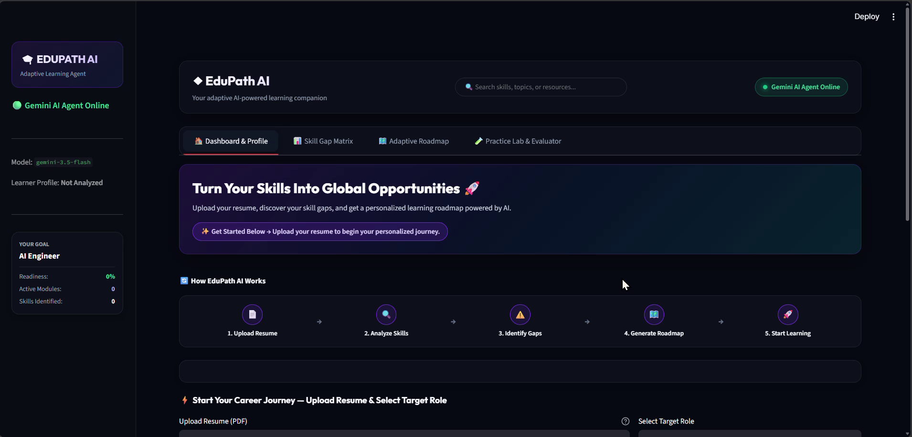
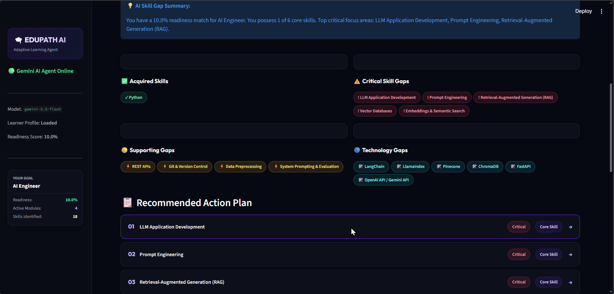
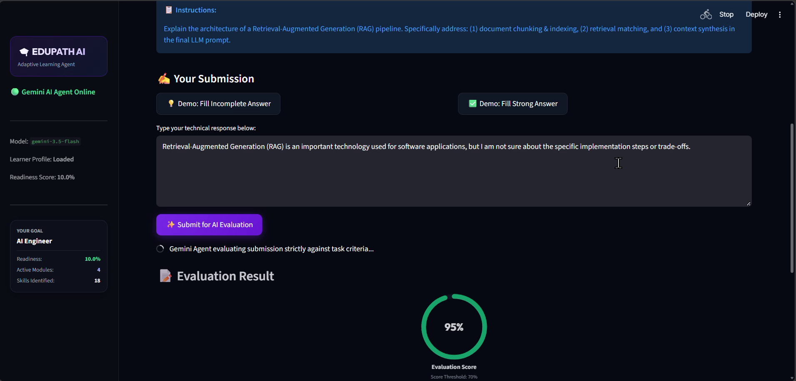
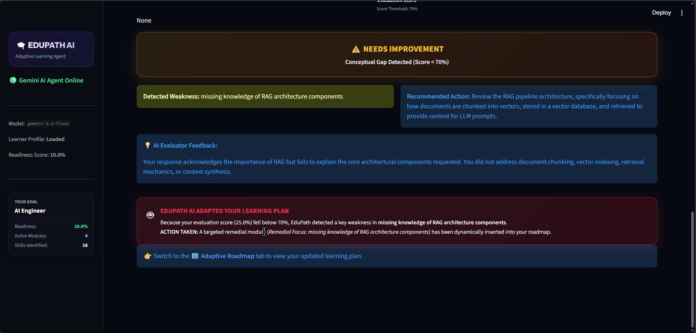

# 🎓 EduPath AI — Personalized Learning & Skill Gap Agent

> An adaptive, Gemini-powered learning agent that reads your resume, finds your skill gaps for a target tech role, builds a personalized roadmap, and **re-plans your learning when it detects you're struggling**.


## 🎬 Demo

📺 **Demo video:** [Watch the full walkthrough here](https://drive.google.com/file/d/1Rn_pv4CewaA16K3xDRNp7ogHUYhS1Ir7/view?usp=drive_link)
<!-- Tip: the recording is ~57 MB, too big to embed on GitHub. Upload to YouTube / Google Drive / Loom and paste the link above. -->


---

## 📌 Problem Statement

Most learners know *where they want to go* ("I want to be an AI Engineer") but not *what exactly they're missing* or *what to learn next*. Generic roadmaps ignore what you already know, and static courses never react when you don't understand something.

## 💡 Solution

EduPath AI acts as a personal learning agent:

1. **Understands you** — parses your PDF resume into a structured learner profile.
2. **Measures the gap** — compares your skills with a benchmark for your target role and produces a readiness score.
3. **Plans your path** — generates a week-by-week roadmap focused only on what you're missing.
4. **Tests and adapts** — you complete practice tasks, an AI evaluator grades them, and if you score below the threshold the agent **automatically inserts a remedial module** into your roadmap.

---

## ✨ Key Features

| Feature | Description |
|---|---|
| 📄 **Resume Analysis** | Upload a text-based PDF resume; Gemini extracts skills, tools, projects, education and certifications into a structured profile. |
| 📊 **Skill Gap Matrix** | Acquired skills, critical gaps, supporting gaps and technology gaps, plus a prioritized action plan. |
| 🎯 **Deterministic Readiness Score** | Not an LLM guess — calculated with fixed weights: **Core skills 60% · Supporting skills 25% · Tools 15%**. |
| 🗺️ **Personalized Roadmap** | Weekly modules with learning objectives, topics, hands-on tasks, resources, estimated hours and expected outcomes. |
| 🧪 **Practice Lab & AI Evaluator** | Skill-specific practice challenges, strictly evaluated by Gemini against task criteria (pass mark: **70%**). |
| 🤖 **Adaptive Re-planning** | Score < 70% → the detected weakness is identified and a **🔴 Remedial Module** is dynamically added to the roadmap. |
| ⚡ **Demo Shortcuts** | One-click "weak answer" / "strong answer" buttons to demonstrate the adaptation loop quickly. |

**Supported target roles:** AI Engineer · Data Scientist · Full Stack Developer · Machine Learning Engineer

---

## 🔄 How It Works

```
Upload Resume (PDF) ──► Extract Learner Profile ──► Skill Gap Analysis ──► Personalized Roadmap
                                                                                   │
                                                                                   ▼
                       Remedial Module inserted  ◄── Score < 70%  ◄── AI Evaluation ◄── Practice Task
```

### App Tabs

- **🏠 Dashboard & Profile** – upload resume, choose target role, view extracted skills, tools, projects, education, certifications and KPI cards.
- **📊 Skill Gap Matrix** – readiness donut chart, gap categories, and a prioritized action plan.
- **🗺️ Adaptive Roadmap** – visual learning journey and expandable weekly modules (remedial modules are highlighted).
- **🧪 Practice Lab & Evaluator** – pick a skill, submit an answer, get a score, detected weakness, recommended action and feedback.

---

## 📸 Screenshots

| Dashboard & Profile | Skill Gap Matrix |
|---|---|
|  |  |

| Practice Lab | Adaptive Re-planning |
|---|---|
|  |  |

<!-- Add your own screenshots to docs/screenshots/ with these file names (or update the paths). -->

---

## 🧪 Demo Walkthrough (from the video)

1. Upload a PDF resume and keep **AI Engineer** as the target role → click **Analyze My Profile**.
2. EduPath extracts **18 skills**, computes a **10% role readiness**, flags **5 critical gaps** (LLM Application Development, Prompt Engineering, RAG, Vector Databases, Embeddings & Semantic Search) and creates **4 roadmap modules**.
3. Open **Practice Lab**, choose *Retrieval-Augmented Generation (RAG)*.
4. Submit a **strong answer → 95% ✅ Passed**.
5. Submit a **weak answer → 25% ⚠️ Needs Improvement** → the weakness ("missing knowledge of RAG architecture components") is detected and **a remedial module is added to the roadmap automatically**.

---

## 🛠️ Tech Stack

- **Language:** Python
- **UI:** [Streamlit](https://streamlit.io/) with custom dark-theme CSS
- **LLM:** Google Gemini via the [`google-genai`](https://pypi.org/project/google-genai/) SDK
- **PDF Parsing:** `pypdf`
- **Data Validation / Structured Outputs:** `pydantic`
- **Config:** `python-dotenv`

---

## 📁 Project Structure

```
EduPath_AI/
├── app.py              # Streamlit app: UI, tabs, session state
├── config.py           # App settings, Gemini config, supported target roles
├── styles.py           # Custom CSS + reusable UI components (cards, donut chart, hero)
├── core/               # Gemini client + EduPathAgent (profile, gap analysis, roadmap, evaluation & adaptation)
├── tools/              # Agent tools, e.g. practice task generator & demo answers
├── data/               # Role benchmark data used for skill-gap scoring
├── tests/              # Tests
├── requirements.txt
├── .env.example
└── LICENSE
```

---

## 🚀 Getting Started

### Prerequisites

- Python 3.9+
- A Google Gemini API key → [get one from Google AI Studio](https://aistudio.google.com/app/apikey)

### Installation

```bash
# 1. Clone the repository
git clone https://github.com/Mohaneswari-Pugazenthi/EduPath_AI.git
cd EduPath_AI

# 2. (Recommended) create a virtual environment
python -m venv venv
source venv/bin/activate        # Windows: venv\Scripts\activate

# 3. Install dependencies
pip install -r requirements.txt

# 4. Configure environment variables
cp .env.example .env            # Windows: copy .env.example .env
```

Edit `.env` and add your key:

```env
GEMINI_API_KEY=your_gemini_api_key_here
GEMINI_MODEL=gemini-2.5-flash
```

### Run the app

```bash
streamlit run app.py
```

Open **http://localhost:8501** in your browser. The sidebar shows **🟢 Gemini AI Agent Online** when your API key is working.

### Run tests

```bash
pytest tests/
```

---

## ⚙️ Configuration

| Variable | Description | Default |
|---|---|---|
| `GEMINI_API_KEY` | Your Google Gemini API key | *(required)* |
| `GEMINI_MODEL` | Gemini model used by the agent | set in `config.py` |

To add or change target roles, edit `TARGET_ROLES` in `config.py` (and add the matching benchmark in `data/`).

---

## ⚠️ Limitations

- Resume must be a **text-based PDF** (scanned/image PDFs can't be parsed).
- Benchmarks currently cover four roles; the AI Engineer benchmark is the most complete.
- Roadmap and evaluation quality depend on the Gemini model and prompt responses.

## 🔮 Future Improvements

- Progress tracking and saved learner profiles across sessions
- More roles and custom job-description matching
- Curated, verified learning resource links
- Support for DOCX / LinkedIn profile import
- Multi-attempt evaluation history and analytics

---

## 🤝 Contributing

Contributions, issues and feature requests are welcome. Fork the repo, create a feature branch, and open a pull request.

## 📄 License

Distributed under the **MIT License**. See [`LICENSE`](LICENSE) for details.

## 👩‍💻 Author

**Mohaneswari Pugazenthi**
GitHub: [@Mohaneswari-Pugazenthi](https://github.com/Mohaneswari-Pugazenthi)

---

⭐ If you found this project useful, consider giving it a star!
